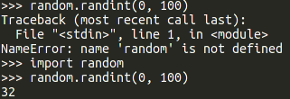
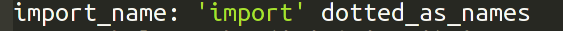

# Hacking Python's grammar

## Getting the source

Download the source with git,

    git clone https://github.com/python/cpython.git
    
or you can download a [zip file](https://github.com/python/cpython/archive/master.zip).

## Compiling

### Windows
    PCbuild\build.bat -e -d

### macOS and Linux
Generate the Makefile with

    ./configure 

Then we can build Python.

    make

#### Compiling with ccache (optional)

If we're compiling on macOS or Linux, we can speed things up with ccache. Compiling with ccache lets us only compile files that have changed so that we don't have to recompile the entire project because one file changed.

##### Ubuntu
    sudo apt-get install ccache

##### Arch Linux
    pacman -S ccache
    
##### macOS (requires Homebrew)

    brew install ccache

To use ccache when we compile Python, we just have to make two changes to the Makefile.
We need to replace the following lines

    CC=   gcc -pthread
    CXX=  g++ -pthread

with the following.

    CC=   ccache gcc -pthread
    CXX=  ccache g++ -pthread

Now everytime running `make` after the first, the compilation will be much quicker.

## Our first change
In Python, we have to `import` modules before we can use them,

but we've decided we don't like the word `import` and want to `giveme` modules instead.

Looking at the [grammar section](https://docs.python.org/devguide/grammar.html) on Python's dev-guide gives us some clues on how to start.
The first thing on that checklist says to look in the file "Grammar/Grammar". When we look through it, we search for the word `import` and
we find this:

So let's add a rule to use `giveme`.

Now, after we `make` we can use our new syntax.

~[using giveme](./giveme.png "Using giveme")
